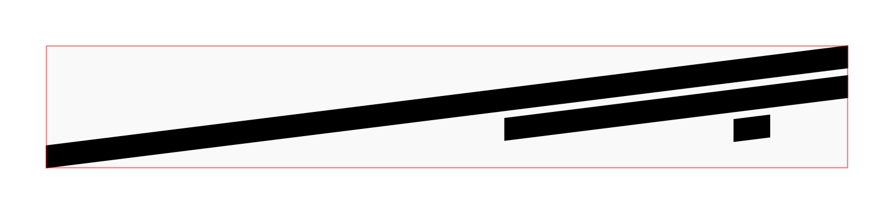

# RhythmView

The `RhythmView` module defines structures for graphically representing rhythmical information.

## BeamsView

A `BeamsView` contains the information necessary to render the beams and beamlets for a given rhythm.

### BeamsView.Configuration

The `BeamsView.Configuration` structure allows you to define the graphical attributes of a set of beams:

- `orientation`: stems up / stems down
- `slope`: slope of the beams
- `width`: width of the beams in pt
- `beamletLength`: length of beamlets
- `displacement`: displacement between center lines of beams
- `color`: color of the beams

### Beam

The `Beam` is the elemental unit of a `BeamsView`, and it is merely a parallelogramical `Path`.

## RhythmView

**WORK IN PROGRESS**

### RhythmView.Configuration

**WORK IN PROGRESS**

### TupletBracketView

**WORK IN PROGRESS**

### TupletBracketView.Configuration

**WORK IN PROGRESS**
